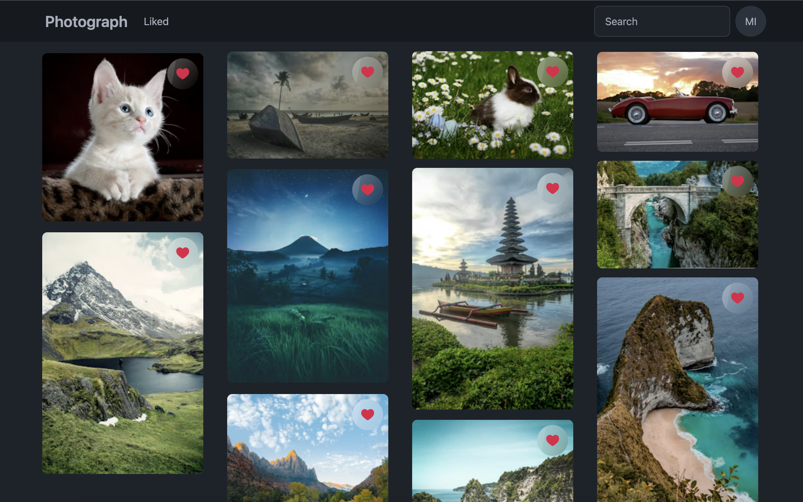

# Photograph

[](https://app.netlify.com/sites/photograph-mzd/deploys)

This is a dynamic image gallery using [Pexels API]() and [Next.js](https://nextjs.org/). This project is bootstrapped with [`create-next-app`](https://github.com/vercel/next.js/tree/canary/packages/create-next-app). It uses [Netlify Blobs](https://docs.netlify.com/blobs/overview/) for data storage and [Netlify Image CDN](https://docs.netlify.com/image-cdn/overview/) for serving optimized images.

Landing page fetches a list of curated images from Pexels API. User can click on the image to view in detailed mode. User can also use the search functionality to find images of any topic. Moreover, authenticated users are allowed to like any image and create his/her own collection of liked images. From the user profile page, user can upload profile picture and change password.

## Demo

Live project link: [https://photograph-mzd.netlify.app](https://photograph-mzd.netlify.app)



## Getting Started

● Install the necessary dependencies:

```bash
pnpm install
```

● Rename the `.env.example` file to `.env` and add your `PEXELS_API_KEY` obtained from [https://www.pexels.com/api](https://www.pexels.com/api/).

● Install [Netlify CLI](https://www.netlify.com/platform/core/cli) globally.

```bash
pnpm add netlify-cli -g
```

● Follow the step by step guide from the [netlify documentation](https://docs.netlify.com/cli/get-started/).

● Once you are done with that, you should be able to run the project locally by this command.

```bash
netlify dev
```

● Open [http://localhost:8888](http://localhost:8888) with your browser to see the result.
